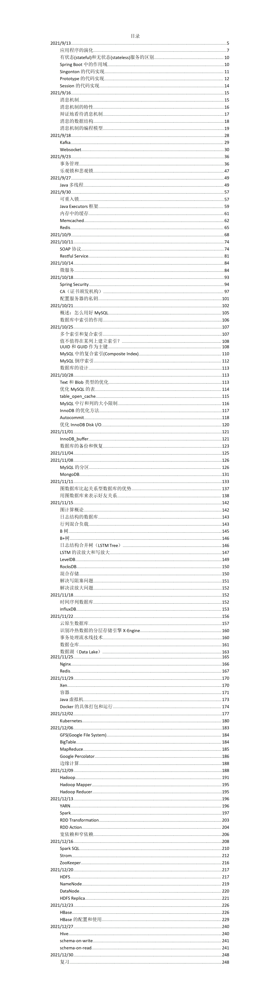

# SE3353-2021-Notes
上海交通大学软件学院课程应用体系架构(SE3353)笔记。

## 课程简介
本课程是软件工程的专业选修课程。通过本课程的教学，使得学生能够综合运用先修课程的相关专业知识，针对企业级应用系统的具体需求，采用先进的架构技术，设计和开发出高质量的企业级应用系统，提高学生的企业级应用系统的设计与开发能力。

本课程将介绍企业级应用系统体系架构设计与实现技术，包括服务器端构件开发、事务管理、安全管理、消息管理、微服务与服务架构、全文搜索技术、面向服务架构、关系型数据库优化、NoSQL数据库管理系统、并行处理技术与计算框架，以及大数据处理技术与工具等，以及它们在企业级应用系统中的应用等。

## 说明

- 因为在课上记笔记需要高速的图文混排，所以选用的docx作为笔记工具。没有markdown化的计划。
- 因为大部分笔记都是课上所记录，不可避免有疏漏之处，包括上课走神可能遗漏知识点。如果你发现了任何问题，欢迎vx联系我或者提交issue。欢迎你提交自己的补充知识点进来。
- 我想进一步推动软件学院中资料的流通，但我个人很难去以这种质量去维护所有课的笔记。欢迎有愿意分享资料的志愿者同学前往[软院笔记仓库](https://github.com/SJTU-SE/awesome-se-notes)贡献。
- 任何转载请引用这个仓库。

## 目录

